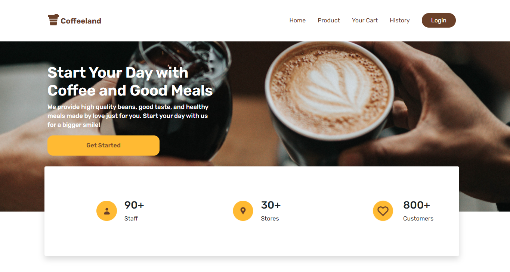

# ExpressJS - CoffeeLand RESTfull API



## Project

Coffeeland is an application developed to sell food and beverages in Coffeeland cafes. This application was developed using Express Js on the backend and Vue Js on the frontend.

## Built With

Express.js v4.x and Node.js

1. Requirements
2. [Node Js](https://nodejs.org/en/download/)
3. Node_modules
4. [Postman](https://www.postman.com/)
5. Web Server (ex. localhost)

## How to run the app ?

1. Open app's directory in CMD or Terminal
2. Type npm install
3. Make new file a called .env
4. Turn on Web Server and MySQL can using Third-party tool like xampp
5. Create a database with the name #nama_database, and Import file sql to phpmyadmin
6. Open Postman desktop application or Chrome web app extension that has installed
7. Choose HTTP Method and enter request url.(ex. localhost:5000/)
8. You can see all the end point [here](https://documenter.getpostman.com/view/13758133/TWDWKHoi)

## Set up .env file

```
PORT=5000
DB_HOST='localhost'
DB_USERS='root'
DB_PASS=''
DB_NAME='coffeeland'
DB_TIME='UTC'

```

## License

© [Firman Azhar R](https://github.com/FirmanAzharR/coffeeLand-Backend)
